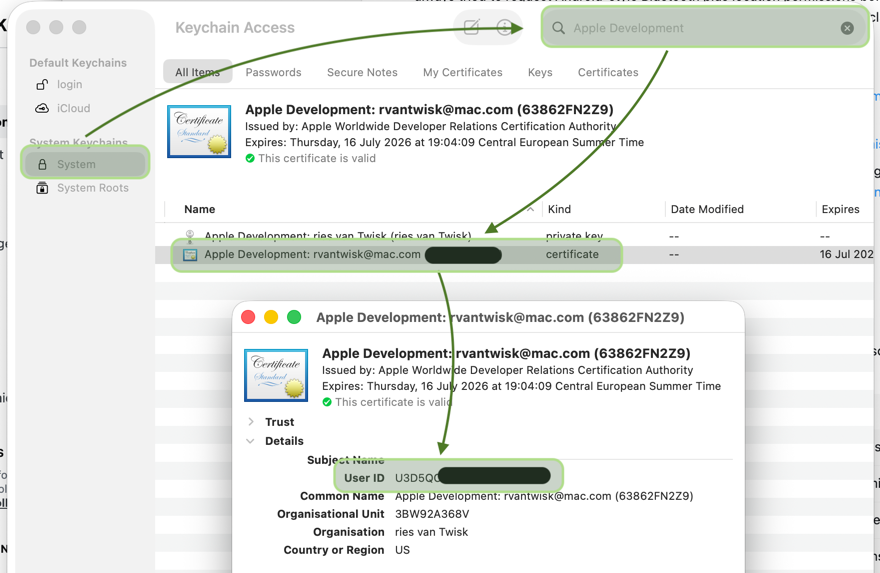

# GATAS Companion

This project is licensed under Apache License 2.0 with the Commons Clause license condition. It is source-available and does not grant commercial resale rights to the software itself.

GATAS Companion is the mobile companion app for the GATAS conspicuity device. It is a Kotlin Multiplatform app that runs on Android and iOS.

The main goal of this application to provide GATAS and your mobile EFB fromn GDL90 data without the need for a WIFI connection. It ensures that
your mobile phone keeps having internet while at teh same time provides GATAS with additional traffic information.

## First-time setup

1Make sure you have an Apple ID that is enrolled in the Apple Developer Program, or a personal team set up in Xcode for device testing.

### Find your Team ID

After you create the developer account, find the Team ID in Keychain Access:

1. Open `Keychain Access`.
2. Find the `Apple Development` certificate associated with your personal account.
3. Open the certificate details and look for the `Organizational Unit` field.
4. That value is your Team ID.



Note: If that does not show anything. Try in XCode to create a iOS application first.

## IPhone development setup

1. On a physical iPhone, enable `Developer Mode` in `Settings > Privacy & Security` and restart when prompted.
2. When you first connect the iPhone, unlock it and accept the trust prompt so the Mac is recognized as a trusted host.

### Prepare the code

1. Copy the local iOS signing template:

```bash
cp iosApp/Configuration/Config.local.xcconfig.example iosApp/Configuration/Config.local.xcconfig
```

2. Open `iosApp/Configuration/Config.local.xcconfig` and replace `YOUR_TEAM_ID_HERE` with your real Apple Team ID.

## Building and running


Open a terminal and run 

```bash
./gradlew build
```

### Deploy to a connected iPhone using X-Code

Open the application and deploy it to your local iPhone using the usual methods


### Deploy to a connected iPhone using CLI

`ios-deploy` is required for this deployment flow because the script installs the built app onto a connected device. Install it first:

```bash
brew install ios-deploy
```

Use the helper script from the repo root:


```bash
./deployIos
```

If you only want to build and skip installation, use:

```bash
./deployIos --no-install
```

The script reads `TEAM_ID` from `iosApp/Configuration/Config.local.xcconfig` when it exists, so you usually do not need to pass a signing team on the command line.

If you do want to override it for a one-off build:

```bash
DEVELOPMENT_TEAM=YOUR_TEAM_ID ./deployIos
```

If `ios-deploy` reports that the device does not recognize this host, unlock the iPhone and accept the trust prompt. If no prompt appears, disconnect and reconnect the cable, keep the phone unlocked, and verify the Mac is trusted in Finder or Xcode's device pairing flow.
